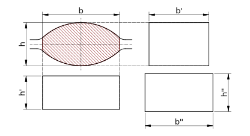

# Wusatowski Spreading Model for groove rolling

## Wusatowski's spread equation

Wusatowski proposed the following equation for estimation of spreading in flat rolling:

```math
    \beta = \frac{b_1}{b_0} = a \times c \times d \times f \times \gamma^{-w}
```

$`\gamma = \frac{h_1}{h_0}`$ is the compression. $`h`$ and $`b`$ are height and width of the workpiece with the indices
0 and 1 denoting the incoming respectively the outgoing profile. $`a`$, $`c`$, $`d`$ and $`f`$ are correction
coefficients for temperature, velocity, material and friction, respectively.

$`c`$ can be assumed as below in dependence on the velocity $`v`$:

```math
    c = \left(-0.002958 + 0.00341 \gamma \right) v + 1.07168 - 0.10431 \gamma
```

$`w`$ is the spread exponent, many different expression were given by various authors for its value. The original
expression by Wusatowski is:

```math
    w = 10^{ -1.269 \left( \frac{h_0}{2 R} \right)^{0.56} \frac{b_0}{h_0} }
```

$`R`$ is the roll radius.

## Equivalent rectangle approach

Wusatowskis spreading model was originally built for flat rolling. A common approach for groove rolling is to calculate
some equivalent rectangular profile to be able to use flat rolling models.

The figure below shows 3 variants of calculating an equivalent rectangle of a profile.



The first variant is to keep the width constant and calculate the height $`h'`$ so that the cross section $`A`$ is
equal:

```math
    h' = \frac{A}{b}
```

The second variant is to keep the height constant and calculate the width $`b'`$ so that the cross section $`A`$ is
equal:

```math
    b' = \frac{A}{h}
```

Both represent the geometry of the profile poorly. A better way is to keep the aspect ratio equal:

```math
    h'' = \sqrt{\frac{A h}{b}}
```

```math
    b'' = \sqrt{\frac{A b}{h}}
```

This variant is used in the current implementation. So $`h`$ and $`b`$ in Wusatowski's model are replaced with $`h''`$
and $`b''`$. In the end, $`b_1`$ can be obtained from $`b_1''`$ by:

```math
    b_1 = \frac{b_1'' h_1}{h_1''}
```

## References

- Wusatowski, Z.: Fundamentals of Rolling, Pergamon Press, 1969
- Hensel, Spittel: Kraft- und Arbeitsbedarf bildsamer Formgebungsverfahren, Deutscher Verlag für Grundstoffindustrie,
  Leipzig, 1978